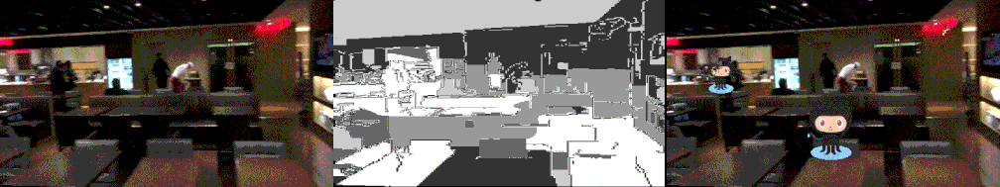

## AR-Depth-Occlusion



A complete pipeline and a python script to implement simple occlusion effects in AR environment or videos. The theory is from the paper [Fast Depth Densification for Occlusion-aware Augmented Reality](https://homes.cs.washington.edu/~holynski/publications/occlusion/index.html), and the c++ implementation is from [AR-Depth-cpp](https://github.com/muskie82/AR-Depth-cpp).

### 1. Main Steps

##### 1.1 Prepare video file "video.MOV" and extract the frames.
```bash
mkdir  ./AR-Depth-cpp/data/frames
ffmpeg -i video.MOV -vf "scale=480:270,fps=20" ./AR-Depth-cpp/data/frames/%06d.png
```
##### 1.2 Get the reconstruction files with [colmap](https://colmap.github.io/install.html).
```bash
colmap automatic_reconstructor --workspace_path ./AR-Depth-cpp/data \
--image_path ./AR-Depth-cpp/data/frames --camera_model=PINHOLE \
--single_camera=1 --data_type=video
```
If no GPU is available or no display is attached, use `--use_gpu=false`.

##### 1.3 Convert the reconstruction files to TXT format.
```bash
mkdir ./AR-Depth-cpp/data/reconstruction
colmap model_converter  --input_path ./AR-Depth-cpp/data/sparse/0 \
--output_path ./AR-Depth-cpp/data/reconstruction --output_type TXT
```

##### 1.4 Remove all the comments lines in TXT files.

##### 1.5 Build AR-Depth-cpp according to `./AR-Depth-cpp/README.md`. Then
    
```bash
cd AR_DEPTH
./AR_DEPTH
cd ..
```

##### 1.6 Run the fusion script.
```bash
python fusion.py
```

### 2. Reference
Reference
* **Fast Depth Densification for Occlusion-aware Augmented Reality**, *Aleksander Holynski and Johannes Kopf*, IACM Transactions on Graphics (Proc. SIGGRAPH Asia). (https://homes.cs.washington.edu/~holynski/publications/occlusion/index.html)
* **AR-Depth**, (https://github.com/facebookresearch/AR-Depth)
* **AR-Depth-cpp**, (https://github.com/muskie82/AR-Depth-cpp)

### 3. License
GPLv3 license.